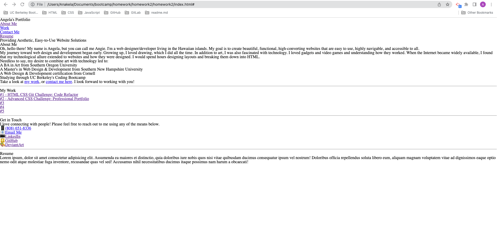
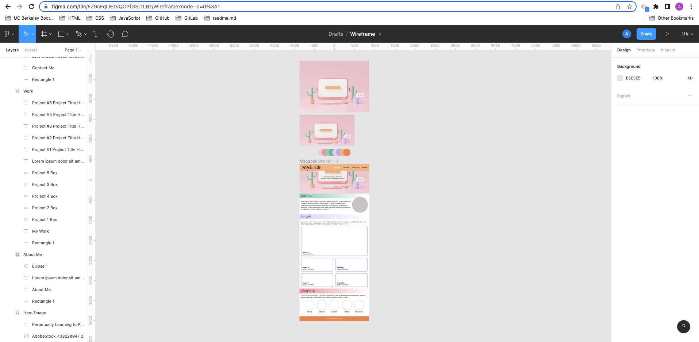
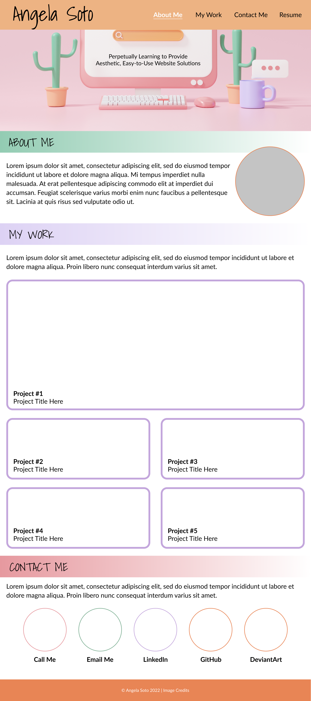

# Advanced CSS Challenge: Professional Portfolio

## Table of Contents

- [Overview](#overview)
  - [The Challenge](#the-challenge)
  - [User Story](#user-story)
  - [Acceptance Criteria](#acceptance-criteria)
  - [Screenshot](#screenshot)
  - [Links](#links)
- [My Process](#my-process)
  - [Built With](#built-with)
  - [What I Learned](#what-i-learned)
  - [Continued Development](#continued-development)
  - [Useful Resources](#useful-resources)
- [Author](#author)
- [Acknowledgments](#acknowledgments)

**Note: Delete this note and update the table of contents based on what sections you keep.**

## Overview

### The Challenge

>Welcome to this week's Challenge! This is an even-numbered week, so you won't be given any starter code. Instead, you'll create a web application from scratch! This week, you'll build a portfolio page, which you can add to as the course progresses.

>A portfolio of work can showcase your skills and talents to employers looking to fill a part-time or full-time position. An effective portfolio highlights your strongest work as well as the thought processes behind it. Students who have portfolios with deployed web applications (meaning they are live on the web) are typically very successful in their career search after the boot camp. This last point can't be stressed enough: having several deployed projects is a minimum requirement to receive an initial interview at many companies.

>With these points in mind, in this Challenge you'll set yourself up for future success by applying the core skills you've recently learned: flexbox, media queries, and CSS variables. You'll get to practice your new skills while creating something that you'll use during your job search. It's a win-win that you'll likely be grateful for in the future!

>>**NOTE**
>>If you don't have enough web applications to showcase at this point, use placeholder images and names. You can change them to real applications as you create them later in the course.

>Let's look at what a user story written from the perspective of a hiring manager might look like. As you might remember, we follow the AS AN / I WANT / SO THAT format.

### User Story

>
```
AS AN employer
I WANT to view a potential employee's deployed portfolio of work samples
SO THAT I can review samples of their work and assess whether they're a good candidate for an open position
```

### Acceptance Criteria

>Here are the critical requirements necessary to develop a portfolio that satisfies a typical hiring manager's needs:

```
GIVEN I need to sample a potential employee's previous work
WHEN I load their portfolio
THEN I am presented with the developer's name, a recent photo or avatar, and links to sections about them, their work, and how to contact them
WHEN I click one of the links in the navigation
THEN the UI scrolls to the corresponding section
WHEN I click on the link to the section about their work
THEN the UI scrolls to a section with titled images of the developer's applications
WHEN I am presented with the developer's first application
THEN that application's image should be larger in size than the others
WHEN I click on the images of the applications
THEN I am taken to that deployed application
WHEN I resize the page or view the site on various screens and devices
THEN I am presented with a responsive layout that adapts to my viewport
```

### Screenshot

#### HTML Without CSS


#### Figma Wireframe/Prototype



### Links
- Solution URL: [Professional Portfolio](https://github.com/anakela/professional-portfolio)
- Live Site URL: [https://anakela.github.io/professional-portfolio/](https://anakela.github.io/professional-portfolio/)

## My Process

- I started this project by outlining the elements I wanted to feature in my HTML file.  I linked my CSS files to the HTML file as well.
- Once I completed the initial HTML, I created a wireframe/prototype in Figma so that I could better envision the site I wanted to build.
- Based on the wireframe/prototype, I began editing my CSS to turn the HTML document into what I had envisioned for the portfolio site.
- Once I had the basic CSS set up for desktop, I searched for images for the contact, work, and about me sections.  Once I added them to the images folder, I linked them to the HTML and CSS documents.


### Built With

- Semantic HTML5 Markup
- CSS
- VSCode
- Figma
- Adobe Photoshop

### What I Learned

Use this section to recap over some of your major learnings while working through this project. Writing these out and providing code samples of areas you want to highlight is a great way to reinforce your own knowledge.

To see how you can add code snippets, see below:

```html
<h1>Some HTML code I'm proud of</h1>
```

```css
.proud-of-this-css {
  color: papayawhip;
}
```

If you want more help with writing markdown, check out [The Markdown Guide](https://www.markdownguide.org/) to learn more.

### Continued Development

Use this section to outline areas that you want to continue focusing on in future projects. These could be concepts you're still not completely comfortable with or techniques you found useful that you want to refine and perfect.

**Note: Delete this note and the content within this section and replace with your own plans for continued development.**

### Useful Resources

#### CSS Resources

- [CSS Tools: Reset CSS](https://meyerweb.com/eric/tools/css/reset/) - This site provided the reset.css code I needed.
- [W3 Schools: How to Create a Hero Image](https://www.w3schools.com/howto/howto_css_hero_image.asp)
- [W3 Schools: CSS Gradients](https://www.w3schools.com/css/css3_gradients.asp)
- [Fixed Headers, On-Page Links, and Overlapping Content, Oh My!](https://css-tricks.com/fixed-headers-on-page-links-and-overlapping-content-oh-my/) - This helped me overcome an issue I experienced with my sticky header not scrolling all the way down the page.
- [W3 Schools: How to Style HR](https://www.w3schools.com/howto/howto_css_style_hr.asp)
- [Stack Overflow: Making text background transparent but not text itself](https://stackoverflow.com/questions/15449280/making-text-background-transparent-but-not-text-itself) - I learned how to apply a background color with transparency to text using this resource.
- [Hex to RGB Color Converter](https://www.rapidtables.com/convert/color/hex-to-rgb.html) - This converter helped me change some of my hex codes to RGB so that I could apply opacity to backgrounds without applying it to the text in front of it.
- [w3 Schools: How TO - Circles](https://www.w3schools.com/howto/howto_css_circles.asp) I learned how to create circles here, which was great for spacing out my photo and contact elements.
- [W3 Schools: How To Create Rounded Images](https://www.w3schools.com/howto/howto_css_rounded_images.asp) - I learned how to place an image in a circle here.
- [MDN Web Docs: box-sizing](https://developer.mozilla.org/en-US/docs/Web/CSS/box-sizing)
- [CodeAcademy: Help with preventing overlapping containers in flexbox](https://discuss.codecademy.com/t/help-with-preventing-overlapping-containers-in-flexbox/497286)
- [Aligning Items in a Flex Container](https://developer.mozilla.org/en-US/docs/Web/CSS/CSS_Flexible_Box_Layout/Aligning_Items_in_a_Flex_Container)
- [CSS Layout - Horizontal & Vertical Align](https://www.w3schools.com/css/css_align.asp)
- [Stack Overflow: how to make navigation bar stretch across the page (HTML)](https://stackoverflow.com/questions/16629835/how-to-make-navigation-bar-stretch-across-the-page-html)
- [How to Create a Sticky Navbar [CSS & JS]](https://alvarotrigo.com/blog/sticky-navbar/)
- [Stack Overflow: How to keep the header static, always on top while scrolling?](https://stackoverflow.com/questions/3593594/how-to-keep-the-header-static-always-on-top-while-scrolling)
- [Stack Overflow: h1 and nav on the same line](https://stackoverflow.com/questions/42397706/h1-and-nav-on-the-same-line)
- [W3 Schools: How TO - Hero Image](https://www.w3schools.com/howto/howto_css_hero_image.asp)
- [MDN Web Docs: flex-basis](https://developer.mozilla.org/en-US/docs/Web/CSS/flex-basis)
- [W3 Schools: How TO - Responsive Text](https://www.w3schools.com/howto/howto_css_responsive_text.asp)

#### README.md Resources

- [How to create a Readme.md file?](https://medium.com/analytics-vidhya/how-to-create-a-readme-md-file-8fb2e8ce24e3) - This site listed several helpful ways to label content in a readme.md file.
- [HOw to create a Readme.md file?](https://medium.com/analytics-vidhya/how-to-create-a-readme-md-file-8fb2e8ce24e3)
- Scott Nelson (TA)'s README.md Template - This _greatly_ helped me with formatting and creating a README.md file.

#### HTML Resources

#### Wireframing/Prototyping Resources

- [Figma](https://www.figma.com/) - I used Figma to create a wireframe/prototype of the site I wanted to build.

#### Image & Icon Resources

- [Adobe Stock](https://stock.adobe.com/) - I used this to find placeholder and stock images.
- I used the following resources to find icons for my "Get in Touch" section:
  - [IconFinder.com - Multimedia icon pack by Sergey Ershov](https://www.iconfinder.com/iconsets/multimedia-75) - I used this to find icons for phone number and email that were free for commercial use.
  - [Where can I find DeviantArt's official logo and media files?](https://www.deviantartsupport.com/en/article/where-can-i-find-deviantarts-official-logo-and-media-files)
  - [LinkedIn's Logos](https://brand.linkedin.com/downloads)
  - [GitHub's Logos](https://github.com/logos)

#### Other Resources

- [Advanced CSS Challenge: Professional Portfolio](https://courses.bootcampspot.com/courses/1693/assignments/26716?module_item_id=537675) - This is where I pulled my quotes for the Challenge, User Story, and Acceptance Criteria.

## Author

- LinkedIn - [Angela Soto](https://www.linkedin.com/in/anakela/)
- GitHub - [@anakela](https://github.com/anakela)

## Acknowledgments

I worked with several other students in various study sessions.  The ones who helped me with issues I was facing are as follows:

- Michael Barrett
- Nolan Spence
- Nifer Kilakila

I also had assistance from the AskBCS Learning Assistant Slack channel.
